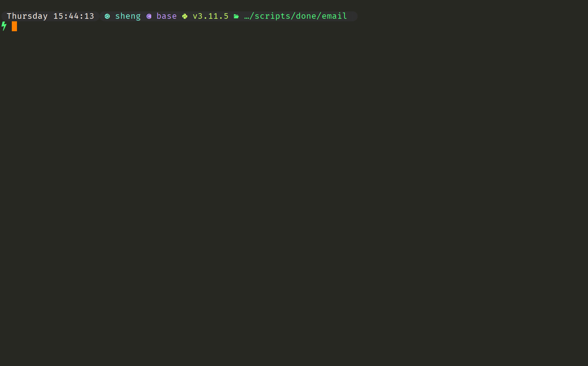

# Neovim 用法

> **Author:** **xiao0o0sheng**
>
> **Update date:** *2023/10/23*

*person.lua 需要根据自己的配置修改*

## 界面示例

## 基础键位

### 基础

| 键位  | 含义             |
| ----- | ---------------- |
| `:q`  | 退出             |
| `:wq` | 保存并退出       |
| `:q!` | 强制退出(不保存) |

### 移动

| 键位             | 含义                           |
| ---------------- | ------------------------------ |
| `h`              | 向 左 移动一个字符             |
| `j`              | 向 下 移动一个行               |
| `k`              | 向 上 移动一个行               |
| `l`              | 向 右 移动一个字符             |
| `^`              | 移动到  当前行第一个 非空 字符 |
| `0`              | 移动到 行首                    |
| `$`              | 移动到 行尾                    |
| `b`              | 跳转到 上一个 单词 的 开头     |
| `w`              | 跳转到 下一个 单词 的开头      |
| `e`              | 跳转到 下一个 单词 的 末尾     |
| `gg`             | 跳转到 文件 的首行             |
| `G`              | 跳转到 文件 的末行             |
| `home`           | 移动到 行首                    |
| `end`            | 移动到 行尾                    |
| `(n)  h/j/k/l/G` | 指定 步长n 跳转                |
| `{`              | 跳转到 上一个 自然段           |
| `}`              | 跳转到 下一个 自然段           |
| `方向键`         |                                |
| `<C-u>`          | 向上翻页                       |
| `<C-d>`          | 向下翻页                       |

### 写入

| 键位              | 含义                                                         |
| ----------------- | ------------------------------------------------------------ |
| `i`               | 在当前光标位置写入                                           |
| `I`               | 在当前光标所在行的行首写入                                   |
| `a`               | 在当前光标的后一个位置写入                                   |
| `A`               | 在当前光标所在行的行尾写入                                   |
| `o`               | 新建下一行，并在下一行进入写入模式                           |
| `O`               | 新建上一行，并在上一行进入写入模式                           |
| `s`               | 删掉当前位置字符并进入写入模式                               |
| `S`               | 删除当前光标所在行并进入写入模式                             |
| `c`               | 删除并进入写入模式，配合方向键和数字键，还可以配合 w/e/b 使用 |
| `ci + { [ ( ' " ` | 删除符号中的内容并进入写入模式                               |
| `ciw`             | 删除当前单词并进入写入模式                                   |
| `cb/cw/ce`        | 从当前光标到  b(上一个单词的开头) /w(下一个单词的开头)  /e(下一个单词的末尾) 位置删除，并进入写入模式 |
| `yf + 字符`       | 从当前位置向后删除到第一个匹配的字符，并进入写入模式         |

### 可视模式

| 键位    | 含义                                             |
| ------- | ------------------------------------------------ |
| `v`     | 在当前光标位置进入可视模式                       |
| `V`     | 在当前光标所在行进入可视模式                     |
| `<C-v>` | 从当前位置 进入 可视模式（代码块选中），可垂直选 |
| `ggvG`  | 全选整个文本                                     |

### 复制

| 键位             | 含义                                     |
| ---------------- | ---------------------------------------- |
| `y`              | 复制当前光标选中区域文本                 |
| `yy`             | 复制当前光标所在行                       |
| `y^`             | 从当前光标位置复制到当前行第一个非空字符 |
| `y$`             | 从当前光标位置复制到行尾                 |
| `yw`             | 从当前光标位置复制到下一个词的开头       |
| `yi + { [ ( ' "` | 复制符号中的内容                         |
| `yf + 字符`      | 从当前位置向后复制到第一个匹配的字符为止 |
| `yiw`            | 复制当前光标所在词组                     |

### 粘贴

| 键位                    | 含义                                                         |
| ----------------------- | ------------------------------------------------------------ |
| `p`                     | 粘贴至光标后(下)， 整行的复制粘贴在游标的下一行，非整行的复制则是粘贴在游标的后面 |
| `P`                     | 粘贴至光标前(上)， 整行的复制粘贴在游标的上一行，非整行的复制则是粘贴在游标的前面 |
| `set clipboard=unnamed` | 跟外部共享剪贴板, sudo apt install vim-gtk                   |

### 删剪

| 键位             | 含义                                                         |
| ---------------- | ------------------------------------------------------------ |
| `x`              | 删除当前光标所在字符                                         |
| `X`              | 删除光标前一个字符                                           |
| `D`              | 删除光标后的所有内容直到行尾                                 |
| `dd`             | 删除整行                                                     |
| `:d$`            | 删除从当前位置到行尾的内容                                   |
| `:nd`            | 删除第 n 行                                                  |
| `:n1,n2d`        | 删除从行号 n1 到 n2 的行                                     |
| `db/dw/de`       | 从当前光标到  b(上一个单词的开头) /w(下一个单词的开头)  /e(下一个单词的末尾) 位置删除 |
| `di + { [ ( ' "` | 删除符号中的内容                                             |
| `df + 字符`      | 从当前位置向后删除到第一个匹配的字符为止                     |

### 撤销

| 键位    | 含义           |
| ------- | -------------- |
| `u`     | 撤销(普通模式) |
| `<C-u>` | 撤销(写入模式) |
| `<C-r>` | 取消撤销       |

### 打开文件

| 键位              | 含义         |
| ----------------- | ------------ |
| `:e path_to_file` | 打开指定文件 |

### 搜索

| 键位       | 含义         |
| ---------- | ------------ |
| `/ + 字符` | 搜索指定字符 |

## 高阶用法

### cmd结果写入

| 键位         | 含义                                     |
| ------------ | ---------------------------------------- |
| `:r ! + cmd` | 将终端运行 cmd 的结果输出 写入到当前文件 |
| `yyp` | 复刻当前行到下一行(新起) |

### 替换

| 键位            | 含义                              |
| --------------- | --------------------------------- |
| `:s/old/new/g`  | 替换当前行中的所有 "old" 为 "new" |
| `:%s/old/new/g` | 替换文档中所有的 "old" 为 "new"   |

### 宏录制

> q 进入宏录制
>
> key 任意字符，将宏绑定到该字符
>
> q 退出宏录制

### vim 命令

| 命令                 | 含义                                    |
| -------------------- | --------------------------------------- |
| `vim -d file1 file2` | 比较两个文件的差异                      |
| `vim -o file1 file2` | 水平分屏，在多个窗口打开多个文件，小写o |
| `vim -O file1 file2` | 垂直分屏，在多个窗口打开多个文件，大写O |
| `vim -p file1 file2` | 在不同的标签页中打开多个文件，小写p     |
| `vim + file`         | 打开文件，光标在文件末尾行首            |
| `vim +n file`        | 打开文件，光标在文件 n 行首             |

## 自定义键位

### 常用

| 键位          | 含义                                      |
| ------------- | ----------------------------------------- |
| `<Space>`     | 本配置中  vim 的*前缀键*                  |
| `Q`           | 退出当前vim窗口                           |
| `W`           | 保存并退出当前vim窗口                     |
| `E`           | 强制退出当前vim窗口                       |
| `<C-a>`       | 全选整个文本                              |
| `re + cmd`    | 执行 shell 命令并将其输出结果写入当前文本 |
| `rn`          | 重命名当前文件(会自动保存)                |
| `mh + 快捷键` | 查看快捷键位的引用                        |
| `<leader>h`   | 查看函数定义/用法                     |

### 窗口

| 键位         | 含义                     |
| ------------ | ------------------------ |
| `<leader>sh` | 向 左 分屏               |
| `<leader>sj` | 向 下 分屏               |
| `<leader>sk` | 向 上 分屏               |
| `<leader>sl` | 向 右 分屏               |
| `<leader>wh` | 窗口 宽度 缩小 5 单位    |
| `<leader>wj` | 窗口 高度 缩小 5 单位    |
| `<leader>wk` | 窗口 高度 扩展 5 单位    |
| `<leader>wl` | 窗口 宽度 扩展 5 单位    |
| `<leader>wt` | 当前窗口移动到新的标签页 |
| `<leader>ww` | 当前窗口最大化           |

### 移动

#### 窗口内移动

| 键位 | 含义          |
| ---- | ------------- |
| `H`  | 左移 5 个单位 |
| `J`  | 下移 5 个单位 |
| `K`  | 上移 5 个单位 |
| `L`  | 右移 5 个单位 |

#### 窗口间移动

| 键位        | 含义             |
| ----------- | ---------------- |
| `<C-left>`  | 切到 左 边的窗口 |
| `<C-down>`  | 切到 下 边的窗口 |
| `<C-up>`    | 切到 上 边的窗口 |
| `<C-right>` | 切到 右 边的窗口 |

### 标签页

| 键位 | 含义                           |
| ---- | ------------------------------ |
| `tt` | 新建 标签页                    |
| `ts` | 将当前窗口分离为一个新的标签页 |
| `tc` | 关闭 当前 标签页               |
| `ta` | 关闭 其他标签页                |
| `th` | th 切换到 上一个 标签页        |
| `tl` | tl 切换到 下一个 标签页        |

### 搜索

| 键位           | 含义                   |
| -------------- | ---------------------- |
| `=`            | 跳转到 下一个 搜索结果 |
| `-`            | 跳转到 上一个 搜索结果 |
| `<leader><CR>` | 取消搜索高亮           |
| `R`            | 启用 *joshuto*         |

### 其他

| 键位         | 含义               |
| ------------ | ------------------ |
| `<leader>sw` | 启用自动换行       |
| `<f10>`      | *LaTeX* 公式提示框 |
| `<leader>rc` | 打开*init.lua*     |

## 插件键位/用法

### 常规

| 键位         | 映射命令    | 用法 | 含义                          |
| ------------ | ----------- | ---- | ----------------------------- |
| `:pl`        | `:Lazy<CR>` |      | 调用 Lazy.nvim 插件管理器面板 |
| `<leader>st` |             |      | 键值对替换                    |
| `rr`         |             |      | 运行当前程序                  |

### autocomplete/自动补全

| 键位        | 含义                                                         |
| ----------- | ------------------------------------------------------------ |
| `<c-Space>` | 调用 自动补全菜单                                            |
| `<c-w>`     | 实现 自动补全和 UltiSnips 触发功能                           |
| `<c-f>`     | 实现 自动补全和 UltiSnips 向前跳转功能                       |
| `<c-e>`     | 退出自动补全                                                 |
| `<c-y>`     | 插入当前自动补全内容                                         |
| `<CR>`      | 回车键确认自动补全条目，若菜单可见且有活动条目，则替换文本并确认选择，否则执行默认的回车操作 |
| `<Tab>`     | 选择下一个自动补全条目，若菜单可见，则插入条目；若光标前有文字，则进行自动补全；否则执行默认的 Tab 操作 |
| `<S-Tab>`   | 选择上一个自动补全条目，若菜单可见，则插入条目；若光标前有文字，则进行自动补全；否则执行默认的 Tab 操作 |

### comments/注释

| 键位         | 含义                       |
| ------------ | -------------------------- |
| `<leader>cn` | 注释当前选中所有代码行     |
| `<leader>cu` | 取消注释当前选中所有代码行 |
| `,,`         | 当前行的 上一行	注释    |
| `..`         | 当前行的 行尾	注释      |

### debugger/调试

| 键位        | 含义                           |
| ----------- | ------------------------------ |
| `fp`        | 调用dap配置文件列表            |
| `<leader>d` | 设置/取消 断点                 |
| `<leader>n` | 继续 调试                      |
| `<leader>s` | 中止 调试                      |
| `<leader>u` | 触发切换 DAP UI 界面，开始调试 |

### editor/编辑器

#### 置反插件

| 键位 | 含义                             |
| ---- | -------------------------------- |
| `gs` | 置反插件，当前词组替换为反义词组 |

#### 智选插件

| 键位   | 用法                                       |
| ------ | ------------------------------------------ |
| `<CR>` | Enter 调用，Enter 下一个，BackSpace 上一个 |

#### 代码块移动插件

| 键位    | 含义                         |
| ------- | ---------------------------- |
| `<A-j>` | 当前代码块向 下 移动一个单位 |
| `<A-k>` | 当前代码块向 上 移动一个单位 |
| `<A-h>` | 当前代码块向 左 移动一个单位 |
| `<A-l>` | 当前代码块向 右 移动一个单位 |

#### 剪贴板插件

| 键位         | 含义                                                   |
| ------------ | ------------------------------------------------------ |
| `<leader>y`  | 查看剪贴板历史的界面，以便你可以浏览并选择要粘贴的内容 |
| `<leader>cl` | 清空剪贴板，(清空 yank 保存的寄存器信息)               |
| `p`          | 在光标后粘贴剪贴板中的内容                             |
| `P`          | 在光标前粘贴剪贴板内容                                 |
| `gp`         | 在光标后粘贴剪贴板中的内容并保持插入模式               |
| `gP`         | 在光标前粘贴剪贴板中的内容并保持插入模式               |

#### 代码块折叠插件

| 键位              | 含义                             |
| ----------------- | -------------------------------- |
| `zr`              | 打开折叠的代码                   |
| `zm`              | 折叠当前代码                     |
| `<leader><space>` | 显示当前光标所在折叠区内的代码块 |

#### 多光标插件

| 键位          | 含义                 |
| ------------- | -------------------- |
| `<c-n>`       | 选取词组             |
| `<c-Up/Down>` | 创建垂直光标         |
| `]`           | 上一个 光标          |
| `[`           | 下一个 光标          |
| `q`           | 跳过当前并获取下一次 |
| `Q`           | 删除当前光标         |

#### 撤销插件

| 键位 | 映射命令              | 含义                      |
| ---- | --------------------- | ------------------------- |
| `Z`  | `:UndotreeToggle<CR>` | 打开/关闭	undotree窗口 |

### fun/趣味插件

| 键位         | 含义              |
| ------------ | ----------------- |
| `<leader>rr` | 代码动画 下雨     |
| `<leader>rg` | 代码动画 游戏     |
| `<leader>rs` | 代码动画 向右滑动 |

### fzf/搜索插件

| 键位       | 含义                           |
| ---------- | ------------------------------ |
| `<c-f>`    | 启用 *fzf*                     |
| `<c-r>`    | 切换预览窗口是否换行显示       |
| `<c-w>`    | 切换预览窗口的开启和关闭       |
| `<c-f>`    | 预览窗口向下滚动一页           |
| `<c-b>`    | 预览窗口向上滚动一页           |
| `<S-left>` | 重置预览窗口的滚动位置         |
| `<Esc>`    | 退出 fzf 窗口，中断搜索        |
| `<Alt-a>`  | 在多选模式下，切换选中所有项目 |

### git

| 键位         | 含义                                           |
| ------------ | ---------------------------------------------- |
| `<leader>g-` | 移动到 上一个 变更块                           |
| `<leader>g=` | 移动到 下一个 变更块                           |
| `<leader>gb` | 在当前行显示所属的 Git 作者和提交信息          |
| `<leader>gr` | 重置当前变更块（hunk）的修改，撤销未提交的修改 |
| `M`          | 在当前光标所在的行，预览显示该行变更的详细信息 |
| `<c-g>`      | 启用 *LazyGit*                                 |

### lsp/语法插件

| 键位                | 含义                                                 |
| ------------------- | ---------------------------------------------------- |
| `<leader>xx`        | 打开诊断信息列表                                     |
| `q`                 | 关闭诊断信息列表                                     |
| `<esc>`             | 光标返回上一个窗口                                   |
| `r`                 | 刷新诊断列表                                         |
| `回车/Tab/左键双击` | 跳转到当前诊断位置，并打开诊断信息                   |
| `<c-x>`             | 上下新分一个屏，并跳转到当前诊断位置                 |
| `<c-v>`             | 左右新分一个屏，并跳转到当前诊断位置                 |
| `<c-t>`             | 新开一个标签页，并跳转到当前诊断位置                 |
| `o`                 | 跳转到当前诊断位置，并关闭诊断列表                   |
| `m`                 | 切换当前诊断区域	"workspace" and "document"       |
| `s`                 | 切换诊断信息的筛选条件	HINT / INFO / WARN / ERROR |
| `P(大写)`           | 高亮显示当前诊断区域                                 |
| `K(大写)`           | 显示当前诊断信息的完整多行消息                       |
| `p(小写)`           | 预览当前选定诊断的位置，该位置会在源代码中高亮显示   |
| `c(小写)`           | 打开与当前选定诊断相关联的代码链接(如果有链接的话)   |
| `k`                 | 上一个 诊断信息                                      |
| `j`                 | 下一个 诊断信息                                      |
| `?`                 | 打开 trouble 的 帮助文档                             |

### notify/提示信息插件

| 键位        | 含义         |
| ----------- | ------------ |
| `<leader>i` | 列出通知信息 |
| `,n`        | 移除通知     |

### search/搜索插件

| 键位           | 含义                     |
| -------------- | ------------------------ |
| `=`            | 下一个 搜索结果          |
| `-`            | 上一个 搜索结果          |
| `#`            | 直接搜索当前光标下的单词 |
| `<Leader><CR>` | 清楚搜索高亮             |
| `<leader>j`    | 跳转                     |
| `<leader>f`    | 启用搜索                 |

### snippets/代码块插件

| 键位            | 含义                                           |
| --------------- | ---------------------------------------------- |
| `<leader><tab>` | 输入代码片段的缩写后按下该键来展开它           |
| `<c-b>`         | 在展开代码片段后，向前跳转到下一个字段的触发器 |
| `<c-z>`         | 在展开代码片段后，向后跳转到上一个字段的触发器 |

### telescope/搜索插件

| 键位         | 含义                       |
| ------------ | -------------------------- |
| `<c-t>`      | 打开 标签页 选择器         |
| `<leader>ff` | 文件	后续可以用 joshuto |
| `<leader>fb` | 缓冲区                     |
| `<leader>fh` | 帮助文档                   |
| `<leader>fd` | 诊断信息                   |
| `<leader>fz` | 配色主题列表               |
| `<leader>fc` | Vim 命令列表               |
| `<leader>fl` | Vim 历史命令列表           |
| `<leader>fs` | 搜索历史                   |
| `<leader>fk` | 快捷映射                   |

### treesitter

| 键位  | 含义                                         |
| ----- | -------------------------------------------- |
| `gnn` | 进入初始选择模式                             |
| `grn` | 递增地选择当前节点                           |
| `grm` | 递减地选择当前节点                           |
| `grc` | 递增地选择当前作用域                         |
| `[c`  | 快速跳转到当前光标所在代码块的上下文起始位置 |

### winbar/窗口栏插件

| 键位        | 含义               |
| ----------- | ------------------ |
| `<Leader>;` | 调用 api.pick 函数 |
| `[c`        | 上一级             |
| `]c`        | 下一级             |

### window-management/窗口管理插件

| 键位        | 含义              |
| ----------- | ----------------- |
| `<leader>m` | 切换窗口 缩放模式 |

